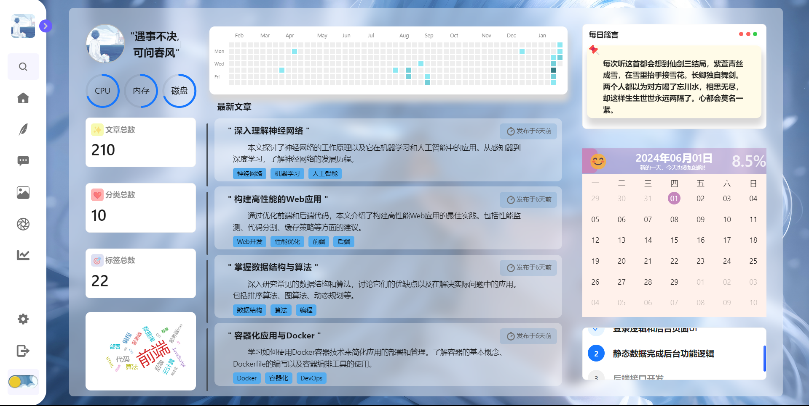
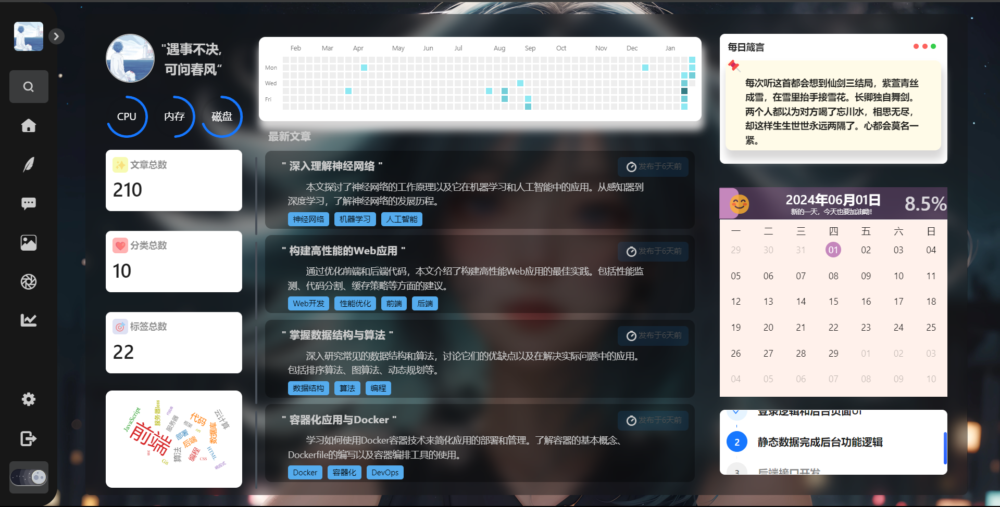
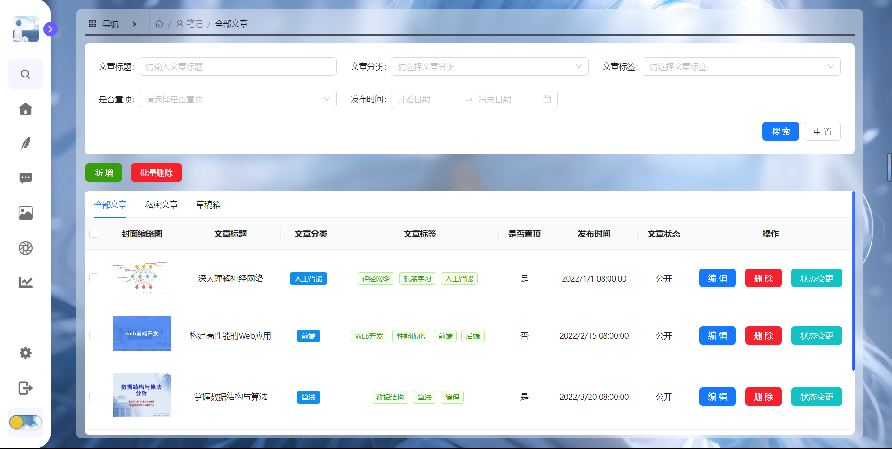
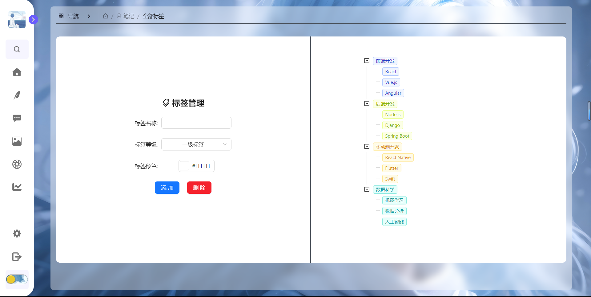

# ☀️ LinMo Blog

  一个正在开发的React+TypeScript+SpringBoot博客

## ✨ 功能特性

- Login+后台页面UI
- 登录逻辑+token持久化与过期处理
- Axios封装

## 👌 技术栈

### 前端
- React + TypeScript
- React Router
- React Reducer
- Sass预编译器
- Axios
- Vite

### 后端
- json-servre模拟接口（暂时）
- Express框架的nodejs接口（部署在了vercel上，可以本地运行）

## 项目结构
```bash
Blog/
|-- server/
|   |-- db.json    //json-server启动文件
|-- src/
|   |-- apis         //封装接口api
|   |-- assets       //静态资源
|   |-- components   //可复用组件
|   |-- pages        //页面组件
|   |-- router       //路由
|   |-- store        //Redux状态管理库
|-- package.json
|-- README.md
```

## 😉 预览

### Login页面


### 后台


### 暗黑模式


### 笔记





### 说说


## 👉 食用方法

1. 克隆项目到本地：

   ```bash
   git clone https://github.com/your-username/react-blog.git

   //启动前端
   cd LinMo
   npm install
   npm run dev

   //启动后端--json-server
   cd server
   json-server --watch db.json --port 3000

   //启动后端--Express框架的nodejs接口(二选一）
   cd server/nodejs
   nodemon app.js   
